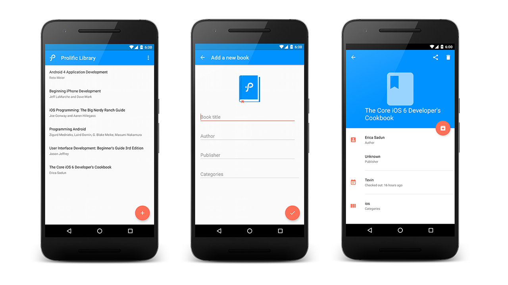

# Prolific Library

    

[https://www.youtube.com/watch?v=T4ilub40oUg](https://www.youtube.com/watch?v=T4ilub40oUg "Youtube Video Demo")
## Requirements

- [Android SDK](http://developer.android.com/sdk/index.html).
- Android [6.0 (API 23) ](http://developer.android.com/tools/revisions/platforms.html#6.0).
- Android SDK Tools (Gradle 2.2.2+)
- Android SDK Build tools 25.0.0
- Android Support Repository 25.0.0
- MinSdkVersion 14

## Libraries

The libraries and tools used include:

- Support library
- RecyclerView and Palette
- [RxJava](https://github.com/ReactiveX/RxJava) and [RxAndroid](https://github.com/ReactiveX/RxAndroid) 
- [Retrofit 2.0](http://square.github.io/retrofit/) and [OkHttp](https://github.com/square/okhttp)
- [Dagger 2](http://google.github.io/dagger/)
- [Butterknife](https://github.com/JakeWharton/butterknife)
- [Material Dialogs](https://github.com/afollestad/material-dialogs)

## Architecture 

Prolific Library follows a Model-View-Presenter (MVP) architectural pattern. 

    

